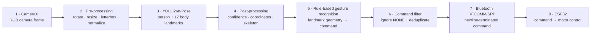
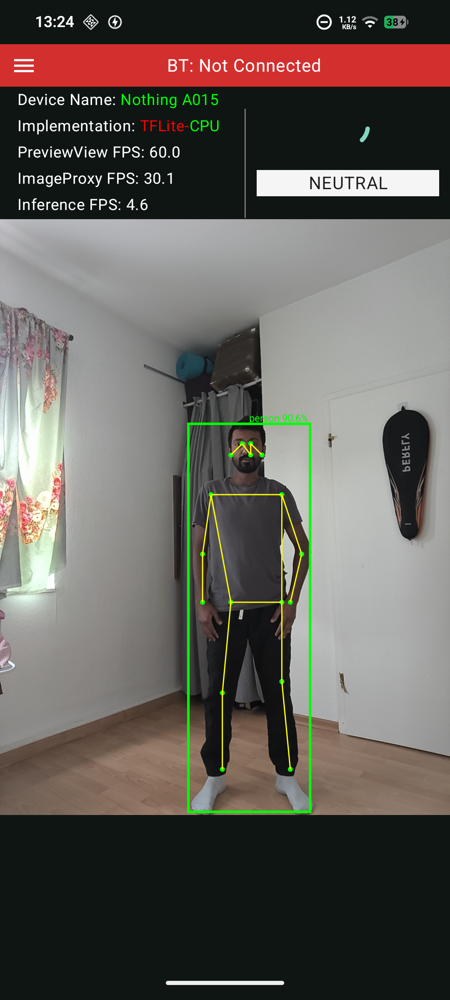
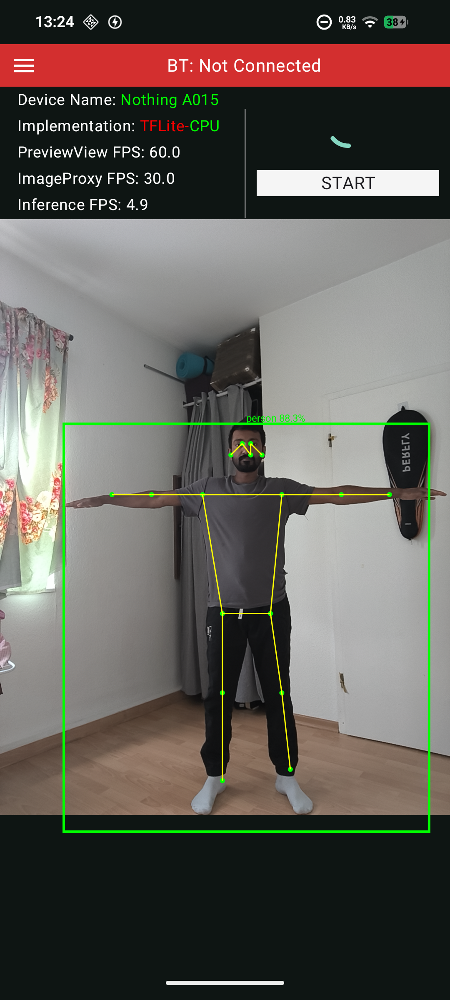
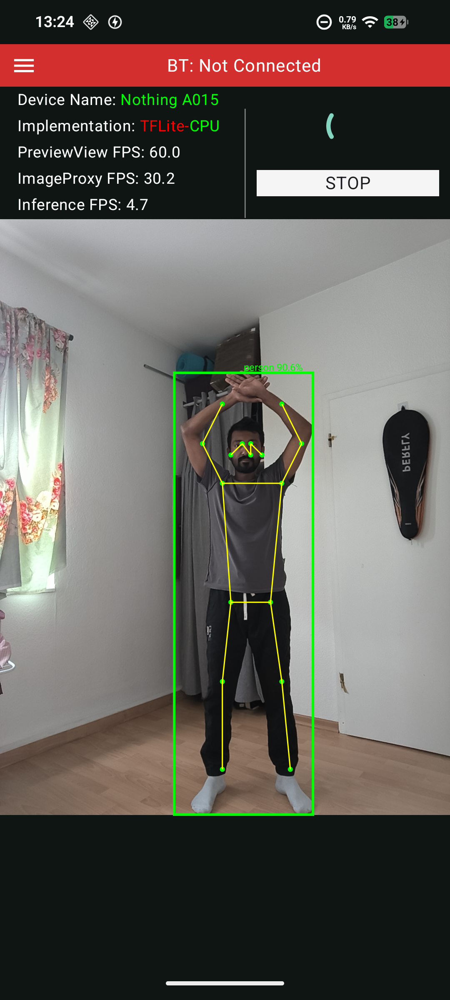
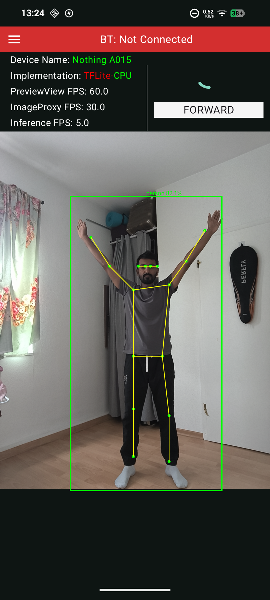
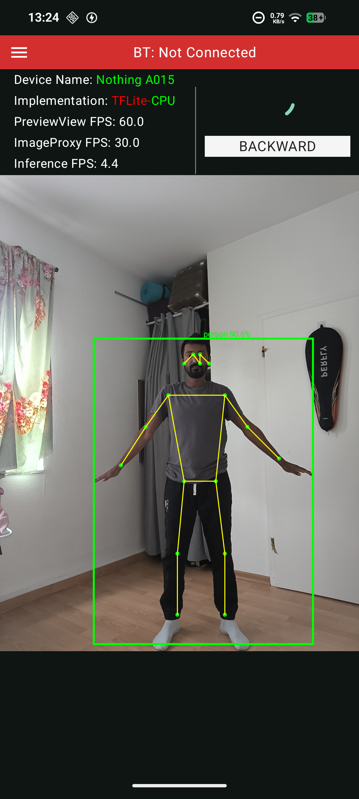
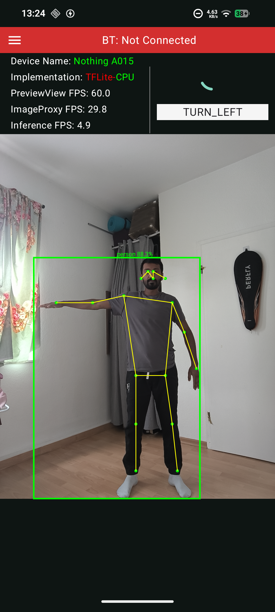
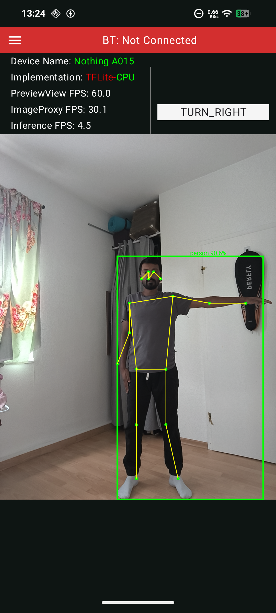
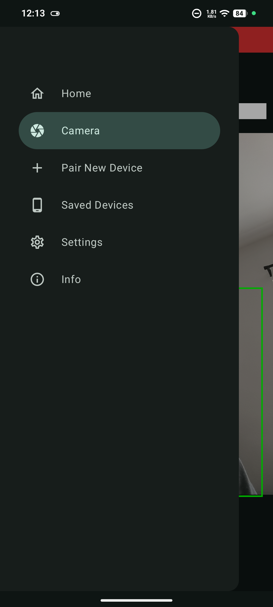

<div align="center">

# TouchlessDroid

### Real-time, touch-free robot control through human body gestures

TouchlessDroid is an Android application that uses on-device pose estimation to translate a person's body posture into movement commands for an ESP32-controlled robot. The phone camera is the input, a pose model provides body landmarks, rule-based logic recognizes the gesture, and Bluetooth delivers the resulting command to the robot.

**CameraX · YOLO26n-Pose · TFLite · ONNX Runtime · PyTorch Mobile · NCNN · Bluetooth · ESP32**

</div>

---

## Project concept

The project investigates whether a mobile phone can act as a complete vision-based interface for controlling a robot without a handheld controller, wearable sensor, or cloud service. A user stands in view of the camera and performs one of seven defined poses. TouchlessDroid processes the camera stream locally, recognizes the pose, and instructs the robot to start, stop, move, or turn.

The application also provides a common Android pipeline for comparing the same pose-estimation model across different inference runtimes, execution backends, and numerical precisions. During operation, it displays the selected implementation, camera throughput, inference throughput, detected person, pose skeleton, confidence score, and recognized command.

### Main features

- Real-time camera acquisition and analysis with CameraX
- Fully on-device human pose estimation—no image is sent to a server
- Seven rule-based body gestures for robot control
- Live person bounding box, 17-keypoint skeleton, and confidence visualization
- Four mobile inference runtimes: TensorFlow Lite, ONNX Runtime, PyTorch Mobile, and NCNN
- CPU, GPU, NNAPI, and Vulkan execution backends, depending on runtime support
- FP32, INT8, and weight/activation-quantized model variants
- Live PreviewView FPS, ImageProxy FPS, and inference FPS measurements
- Bluetooth device discovery, pairing, saved-device selection, and connection status
- Deduplicated command transmission to an ESP32-controlled robot

## End-to-end pipeline



### 1. Image acquisition

CameraX continuously supplies frames to the application through an `ImageProxy` analysis pipeline. Each accepted frame is converted into a bitmap, corrected for camera rotation, resized and letterboxed to the model's square input, and normalized into the tensor format required by the selected runtime.

### 2. Pose estimation model

TouchlessDroid uses **YOLO26n-Pose**, a lightweight pose-estimation model prepared for mobile execution. Its input resolution is **640 × 640 pixels**. For every detected person, the model produces a bounding box, a confidence score, and **17 COCO body landmarks**. The application selects the first detected person for gesture control.

`nose`, `eyes`, `ears`, `shoulders`, `elbows`, `wrists`, `hips`, `knees`, and `ankles`.

The model is stored in runtime-specific formats so that the surrounding application pipeline remains the same while the inference engine changes:

| Runtime | Model format | Available precision | Execution backend |
|---|---|---|---|
| TensorFlow Lite | `.tflite` | FP32, INT8, quantized weights/activations | CPU, GPU, NNAPI |
| ONNX Runtime | `.onnx` | FP32, INT8 | CPU, NNAPI |
| PyTorch Mobile | `.ptl` | FP32 | CPU, Vulkan GPU |
| NCNN | `.param` + `.bin` | FP32 | CPU, Vulkan GPU |

After inference, the output is filtered by confidence, converted from model coordinates back to preview coordinates, and rendered as the green person box and yellow pose skeleton visible in the screenshots.

### 3. From landmarks to gestures

The machine-learning model does **not** directly predict robot commands. It only locates the body landmarks. `GestureDetector` then applies deterministic geometric rules to the nose, shoulders, elbows, and wrists. It compares their relative positions and limb distances to classify the current pose into one of seven commands.

| Gesture | Recognized pose | Robot meaning |
|---|---|---|
| `NEUTRAL` | Both arms held naturally downward | Neutral/idle state |
| `START` | Both arms extended horizontally in a T-pose | Start robot operation |
| `STOP` | Arms crossed above the head | Stop the robot |
| `FORWARD` | Both arms raised above the head | Move forward |
| `BACKWARD` | Both arms directed downward | Move backward |
| `TURN_LEFT` | Left arm horizontal, right arm down | Turn left |
| `TURN_RIGHT` | Right arm horizontal, left arm down | Turn right |

If no valid pose is found, the result is `NONE`; if no person is detected, the application reports `NO_PERSON`. These states are not treated as movement gestures. Before transmission, repeated identical commands are suppressed so the Bluetooth connection is not flooded with the same instruction on every camera frame.

### 4. Bluetooth communication with the robot

The Android phone and ESP32 communicate through **Bluetooth Classic RFCOMM**, using the Serial Port Profile (SPP) UUID when the paired device does not advertise another UUID. The app discovers or selects a saved device, opens a `BluetoothSocket`, and obtains its output stream.

Each recognized `RobotCommand` is serialized as its enum name followed by a newline. For example:

```text
FORWARD\n
TURN_LEFT\n
STOP\n
```

The ESP32 runs the corresponding Bluetooth serial service. Its firmware reads one line at a time, maps the received text to a robot action, and drives the motor controller accordingly. This gives the complete control path:

```text
body pose → Android camera → pose landmarks → gesture command
          → Bluetooth serial → ESP32 → motor driver → robot movement
```

The phone therefore performs perception and command generation, while the ESP32 is responsible for receiving the command and controlling the robot hardware.

## Application screenshots

The camera screen combines the live preview with pose visualization, the recognized command, Bluetooth state, active runtime/backend, and performance measurements.

<table>
  <tr>
    <td align="center" width="25%"><br/><b>Neutral</b></td>
    <td align="center" width="25%"><br/><b>Start</b></td>
    <td align="center" width="25%"><br/><b>Stop</b></td>
    <td align="center" width="25%"><br/><b>Forward</b></td>
  </tr>
  <tr>
    <td align="center" width="25%"><br/><b>Backward</b></td>
    <td align="center" width="25%"><br/><b>Turn left</b></td>
    <td align="center" width="25%"><br/><b>Turn right</b></td>
    <td align="center" width="25%"><br/><b>App navigation</b></td>
  </tr>
</table>

## Runtime configuration and performance

The 14 configurations below compare inference latency, complete application throughput, processor load, and memory consumption. **Mean inference time** measures model execution for one frame. **End-to-end FPS** covers the complete application pipeline, including frame preparation, inference, post-processing, gesture recognition, and UI processing. CPU usage may exceed 100% because the measurement is accumulated across multiple CPU cores.

| # | Runtime | Delegate | Precision | Mean inference time (ms) | End-to-end FPS | Mean CPU usage (%) | Peak PSS (MB) | Peak RSS (MB) |
|---:|---|---|---|---:|---:|---:|---:|---:|
| 1 | TFLite | CPU | FP32 | 409,996 | 2,01 | 186,683 | 290,706 | 396,244 |
| 2 | TFLite | CPU | INT8 | 135,386 | 3,851 | 180,817 | 218,594 | 314,096 |
| 3 | TFLite | GPU | FP32 | 453,342 | 1,818 | 181,433 | 303,793 | 385,322 |
| 4 | TFLite | GPU | INT8 | 171,145 | 3,27 | 174,317 | 267,312 | 349,201 |
| 5 | TFLite | NNAPI | FP32 | 458,705 | 1,875 | 138,8 | 281,708 | 374,241 |
| 6 | TFLite | NNAPI | INT8 | 155,126 | 3,767 | 137,033 | 258 | 351,063 |
| 7 | ONNX | CPU | FP32 | 181,51 | 3,467 | 339,55 | 371,694 | 463,211 |
| 8 | ONNX | CPU | INT8 | 149,453 | 3,873 | 327 | 415,386 | 506,787 |
| 9 | ONNX | NNAPI | FP32 | 67,59 | 6,93 | 122,65 | 271,561 | 367,251 |
| 10 | ONNX | NNAPI | INT8 | 635,384 | 1,395 | 244,633 | 352,514 | 401,971 |
| 11 | PyTorch | CPU | FP32 | 346,589 | 2,199 | 332,267 | 296,446 | 398,238 |
| 12 | PyTorch | GPU | FP32 | 356,041 | 2,154 | 333,5 | 299,043 | 400,402 |
| 13 | NCNN | CPU | FP32 | 94,365 | 8,97 | 399,733 | 232,364 | 329,282 |
| 14 | NCNN | GPU | FP32 | 308,316 | 2,945 | 178,283 | 388,371 | 462,469 |

> Values use a decimal comma, matching the original benchmark data.

## Architecture at a glance

| Layer | Responsibility | Main components |
|---|---|---|
| Presentation | Camera preview, overlays, runtime selection, performance values, Bluetooth status | Jetpack Compose, `CameraViewModel`, `BluetoothViewModel`, `StateFlow` |
| Domain | Convert pose landmarks into stable robot intent | `GestureDetector`, `GestureToCommandUseCase`, `RobotCommand` |
| Inference/data | Load the selected model, prepare tensors, execute inference, and post-process keypoints | `PoseRepositoryFactory`, TFLite/ONNX/PyTorch/NCNN repositories |
| Communication | Discover, pair, connect, and transmit commands | `BluetoothManager`, RFCOMM `BluetoothSocket` |
| Robot | Parse commands and actuate the motors | ESP32 Bluetooth firmware and motor controller |

---

<div align="center">
  <sub>Camera-based perception on Android · Rule-based gesture interpretation · Bluetooth robot control</sub>
</div>
