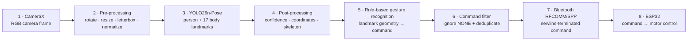

TouchlessDroid turns body gestures into real-time movement commands for an ESP32-controlled robot. It brings together live camera processing, on-device pose estimation, gesture recognition, Bluetooth communication, and a modern Jetpack Compose interface in one complete Android experience.

## What TouchlessDroid does

TouchlessDroid transforms an Android phone into a vision-based robot controller—no handheld controller, wearable sensor, or cloud processing required. A user stands in front of the camera and performs one of seven supported gestures. The app recognizes the pose locally and tells the robot to start, stop, move forward or backward, or turn.

The app is also built to run the same pose model through multiple mobile inference engines. Runtime, delegate, and precision can be switched from the UI, while live overlays display the detected person, pose skeleton, confidence, recognized command, Bluetooth status, and performance metrics.

### Main features

- Real-time camera acquisition and analysis with CameraX
- Fully on-device human pose estimation—no image is sent to a server
- Seven rule-based body gestures for robot control
- Live person bounding box, 17-keypoint skeleton, and confidence visualization
- Four mobile inference runtimes: TensorFlow Lite, ONNX Runtime, PyTorch Mobile, and NCNN
- CPU, GPU, NNAPI, and Vulkan execution backends, depending on runtime support
- FP32 and INT8 model variants
- Live PreviewView FPS, ImageProxy FPS, and inference FPS measurements
- Bluetooth device discovery, pairing, saved-device selection, and connection status
- Deduplicated command transmission to an ESP32-controlled robot

## End-to-end pipeline



### 1. Image acquisition

CameraX continuously supplies frames from the phone camera. Each frame is corrected for rotation and prepared for the selected inference runtime before being passed to the pose model.

### 2. Pose estimation model

TouchlessDroid uses **YOLO26n-Pose**, a lightweight pose-estimation model running at **640 × 640 pixels**. It returns a person bounding box, confidence score, and **17 COCO body landmarks**. The first detected person is used for gesture control.

`nose`, `eyes`, `ears`, `shoulders`, `elbows`, `wrists`, `hips`, `knees`, and `ankles`.

The model is stored in runtime-specific formats so that the surrounding application pipeline remains the same while the inference engine changes:

| Runtime | Model format | Available precision | Execution backend |
|---|---|---|---|
| TensorFlow Lite | `.tflite` | FP32, INT8, quantized weights/activations | CPU, GPU, NNAPI |
| ONNX Runtime | `.onnx` | FP32, INT8 | CPU, NNAPI |
| PyTorch Mobile | `.ptl` | FP32 | CPU, Vulkan GPU |
| NCNN | `.param` + `.bin` | FP32 | CPU, Vulkan GPU |

The result is drawn directly over the camera preview as a person box and pose skeleton, making the recognition process visible in real time.

### 3. From landmarks to gestures

The pose model finds body landmarks; it does not directly choose a robot action. TouchlessDroid compares the positions of the nose, shoulders, elbows, and wrists and converts their geometry into one of seven clear commands.

| Gesture | Recognized pose | Robot meaning |
|---|---|---|
| `NEUTRAL` | Both arms held naturally downward | Neutral/idle state |
| `START` | Both arms extended horizontally in a T-pose | Start robot operation |
| `STOP` | Arms crossed above the head | Stop the robot |
| `FORWARD` | Both arms raised above the head | Move forward |
| `BACKWARD` | Both arms directed downward | Move backward |
| `TURN_LEFT` | Left arm horizontal, right arm down | Turn left |
| `TURN_RIGHT` | Right arm horizontal, left arm down | Turn right |

When no valid gesture or person is detected, no movement command is produced. Repeated commands are filtered before transmission so the same instruction is not sent on every camera frame.

### 4. Bluetooth communication with the robot

The Android phone and ESP32 communicate through **Bluetooth Classic RFCOMM/SPP**. The app can discover nearby devices, pair with the robot, reconnect to a saved device, and show the connection state directly in the interface.

Each recognized `RobotCommand` is serialized as its enum name followed by a newline. For example:

```text
FORWARD\n
TURN_LEFT\n
STOP\n
```

The ESP32 reads each command, maps it to a robot action, and drives the motor controller. This creates the complete control path:

```text
body pose → Android camera → pose landmarks → gesture command
          → Bluetooth serial → ESP32 → motor driver → robot movement
```

The phone therefore performs perception and command generation, while the ESP32 is responsible for receiving the command and controlling the robot hardware.

## Application screenshots

The camera screen combines the live preview with pose visualization, the recognized command, Bluetooth state, active runtime/backend, and performance measurements.

<table class="screenshot-grid">
  <tr>
    <td align="center" width="25%"><br/><b>Neutral</b></td>
    <td align="center" width="25%"><br/><b>Start</b></td>
    <td align="center" width="25%"><br/><b>Stop</b></td>
    <td align="center" width="25%"><br/><b>Forward</b></td>
  </tr>
  <tr>
    <td align="center" width="25%"><br/><b>Backward</b></td>
    <td align="center" width="25%"><br/><b>Turn left</b></td>
    <td align="center" width="25%"><br/><b>Turn right</b></td>
    <td align="center" width="25%"><br/><b>App navigation</b></td>
  </tr>
</table>

## Runtime configuration and performance

The app was tested on a **Nothing CMF A015** phone across 14 runtime configurations. The results compare model latency, complete application throughput, processor load, and memory consumption. **Mean inference time** measures model execution for one frame, while **end-to-end FPS** reflects the complete camera-to-command application pipeline. CPU usage may exceed 100% because work is distributed across multiple CPU cores.

| # | Runtime | Delegate | Precision | Mean inference time (ms) | End-to-end FPS | Mean CPU usage (%) | Peak PSS (MB) | Peak RSS (MB) |
|---:|---|---|---|---:|---:|---:|---:|---:|
| 1 | TFLite | CPU | FP32 | 409,996 | 2,01 | 186,683 | 290,706 | 396,244 |
| 2 | TFLite | CPU | INT8 | 135,386 | 3,851 | 180,817 | 218,594 | 314,096 |
| 3 | TFLite | GPU | FP32 | 453,342 | 1,818 | 181,433 | 303,793 | 385,322 |
| 4 | TFLite | GPU | INT8 | 171,145 | 3,27 | 174,317 | 267,312 | 349,201 |
| 5 | TFLite | NNAPI | FP32 | 458,705 | 1,875 | 138,8 | 281,708 | 374,241 |
| 6 | TFLite | NNAPI | INT8 | 155,126 | 3,767 | 137,033 | 258 | 351,063 |
| 7 | ONNX | CPU | FP32 | 181,51 | 3,467 | 339,55 | 371,694 | 463,211 |
| 8 | ONNX | CPU | INT8 | 149,453 | 3,873 | 327 | 415,386 | 506,787 |
| 9 | ONNX | NNAPI | FP32 | 67,59 | 6,93 | 122,65 | 271,561 | 367,251 |
| 10 | ONNX | NNAPI | INT8 | 635,384 | 1,395 | 244,633 | 352,514 | 401,971 |
| 11 | PyTorch | CPU | FP32 | 346,589 | 2,199 | 332,267 | 296,446 | 398,238 |
| 12 | PyTorch | GPU | FP32 | 356,041 | 2,154 | 333,5 | 299,043 | 400,402 |
| 13 | NCNN | CPU | FP32 | 94,365 | 8,97 | 399,733 | 232,364 | 329,282 |
| 14 | NCNN | GPU | FP32 | 308,316 | 2,945 | 178,283 | 388,371 | 462,469 |

> All measurements were collected on the Nothing CMF A015. Values use a decimal comma.

## Architecture at a glance

| Layer | Responsibility | Main components |
|---|---|---|
| Presentation | Camera preview, overlays, runtime selection, performance values, Bluetooth status | Jetpack Compose, `CameraViewModel`, `BluetoothViewModel`, `StateFlow` |
| Domain | Convert pose landmarks into stable robot intent | `GestureDetector`, `GestureToCommandUseCase`, `RobotCommand` |
| Inference/data | Load the selected model, prepare tensors, execute inference, and post-process keypoints | `PoseRepositoryFactory`, TFLite/ONNX/PyTorch/NCNN repositories |
| Communication | Discover, pair, connect, and transmit commands | `BluetoothManager`, RFCOMM `BluetoothSocket` |
| Robot | Parse commands and actuate the motors | ESP32 Bluetooth firmware and motor controller |

---

<div align="center">
  <sub>Camera-based perception on Android · Rule-based gesture interpretation · Bluetooth robot control</sub>
</div>
